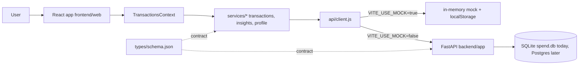

# Architecture Overview

FinanceOS is a personal finance app split into three top-level pieces:

- [`frontend/web`](../../frontend/web) — Vite + React 19 + Tailwind v3 single-page app
- [`backend/`](../../backend) — FastAPI service backed by SQLite (Postgres later)
- [`infra/`](../../infra) — deployment glue (compose, future IaC)

The frontend is built **schema-first**: it ships a fully working mock provider so we can iterate on UX without waiting on the backend. The backend implements the same shapes the frontend already consumes.

## System view

## How a request flows

1. A page (e.g. `OverviewPage`) reads transactions via `useTransactions()`.
2. The hook returns state from `TransactionsContext`, which is hydrated on mount by calling a service function.
3. The service (e.g. `services/transactions.listTransactions`) checks `USE_MOCK`:
   - **Mock**: returns seeded data from `data/mockTransactions.js`, mutated by an in-memory store.
   - **Live**: calls `apiClient.get(ENDPOINTS.transactions.list)`, which hits the FastAPI backend.
4. The backend runs the route handler, queries the DB, returns JSON that conforms to `schema.json`.
5. The service returns the data to the context, which re-renders consumers.

Mutations are optimistic: the context applies the change locally first, then calls the service, and rolls back on failure.

## The contract

The single source of truth lives in [`frontend/web/src/types/schema.json`](../../frontend/web/src/types/schema.json), with examples in `examples.json`, JSDoc typedefs in `index.js`, and a backend-engineer README. Both sides of the wire must agree with that file. Adding a field is a frontend-leads-backend change: update the schema first, expose it in the mock, then ask the backend to fulfil it.

## Boundaries

- **No business logic in components.** Pure functions live in [`frontend/web/src/utils/`](../../frontend/web/src/utils). Components render.
- **No `fetch` calls in components.** Everything goes through [`services/`](../../frontend/web/src/services), which goes through [`api/client.js`](../../frontend/web/src/api/client.js).
- **No state outside React.** Persistent client state goes through hooks (`useProfile`, `useTheme`) that wrap `localStorage` and notify subscribers.
- **No raw DB access in routers.** Backend routers call services, services call the data layer.

## Where to read next

- [`frontend.md`](./frontend.md) — folder-by-folder map of the web app
- [`backend.md`](./backend.md) — current backend skeleton + the route plan
- [`../design/design-system.md`](../design/design-system.md) — visual language
- [`../adr/`](../adr) — accepted architectural decisions and their context
